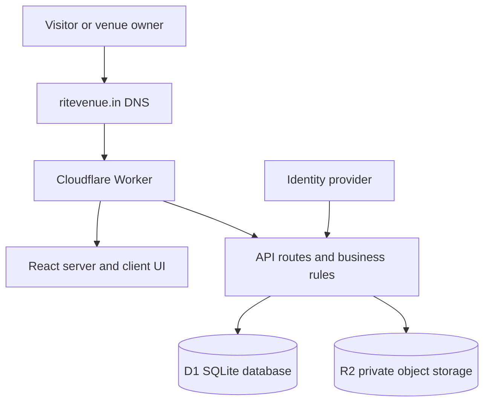

# RiteVenue architecture

## Runtime

RiteVenue is a full-stack TypeScript application. React pages and API routes are compiled into one Cloudflare Worker deployment. Public and protected pages call the same backend; browsers do not connect directly to D1 or R2.

## Responsibilities

| Area | Implementation | Responsibility |
| --- | --- | --- |
| Pages | `app/` | Public catalog, venue details, owner/admin workspaces |
| UI | `components/` | Forms, search, calendars and moderation screens |
| APIs | `app/api/` | Input validation, authorization and persistence |
| Domain logic | `lib/` | Pricing, publication rules, calendars and listing mapping |
| Schema | `db/schema.ts` | Drizzle representation of D1 tables |
| Migrations | `drizzle/` | Ordered schema changes applied by Wrangler |
| Files | R2 through `BUCKET` | Private owner-uploaded photographs |
| Database | D1 through `DB` | Applications, drafts, calendars and retained prototype data |

## Trust boundaries

- Only the Worker may access D1 and R2.
- Public submissions are validated, same-origin checked, rate-limited and never automatically published.
- Owner photos are served publicly only when referenced by an approved listing with publication consent.
- Administrator status is an authorization decision after authentication.
- Runtime secrets belong in the hosting platform or GitHub environment secrets, never in source control.

## Environments

| Environment | Purpose | Deployment |
| --- | --- | --- |
| Local | Development with local D1/R2 emulation | Developer machine only |
| Cloudflare staging | Independent infrastructure and migration rehearsal | Manual GitHub Action |
| Current production | Public directory at `ritevenue.in` | Sites-managed deployment |
| Future Cloudflare production | Independent owner-controlled runtime | Deliberately not configured yet |

Staging and production must use separate D1 databases, R2 buckets, Worker names, secrets and hostnames.
